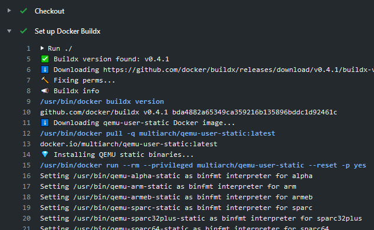

[](https://github.com/crazy-max/ghaction-docker-buildx/releases/latest)
[](https://github.com/marketplace/actions/docker-buildx)
[](https://github.com/crazy-max/ghaction-docker-buildx/actions?workflow=test)
[](https://codecov.io/gh/crazy-max/ghaction-docker-buildx)
[](https://github.com/sponsors/crazy-max)
[](https://www.paypal.me/crazyws)

## About

GitHub Action to set up Docker [Buildx](https://github.com/docker/buildx).

If you are interested, [check out](https://git.io/Je09Y) my other :octocat: GitHub Actions!



___

* [Usage](#usage)
  * [Quick start](#quick-start)
  * [Build and push to DockerHub](#build-and-push-to-dockerhub)
  * [Leverage buildx cache](#leverage-buildx-cache)
* [Projects using this action](#projects-using-this-action)
* [Customizing](#customizing)
  * [inputs](#inputs)
  * [outputs](#outputs)
  * [environment variables](#environment-variables)
* [Limitation](#limitation)
* [How can I help?](#how-can-i-help)
* [License](#license)

## Usage

### Quick start

Here is a simple example to build a Docker image with buildx (BuildKit)

```yaml
name: buildx

on:
  pull_request:
    branches: master
  push:
    branches: master
    tags:

jobs:
  buildx:
    runs-on: ubuntu-latest
    steps:
      -
        name: Checkout
        uses: actions/checkout@v2
      -
        name: Set up Docker Buildx
        id: buildx
        uses: crazy-max/ghaction-docker-buildx@v2
        with:
          buildx-version: latest
          qemu-version: latest
      -
        name: Available platforms
        run: echo ${{ steps.buildx.outputs.platforms }}
      -
        name: Run Buildx
        run: |
          docker buildx build \
            --platform linux/386,linux/amd64,linux/arm/v6,linux/arm/v7,linux/arm64,linux/ppc64le,linux/s390x \
            --output "type=image,push=false" \
            --file ./test/Dockerfile ./test
```

### Build and push to DockerHub

Another example to build and push [Diun](https://github.com/crazy-max/diun) Docker image on DockerHub.

* On `push` event, Docker image `crazymax/diun:edge` is **built** and **pushed** on DockerHub.
* On `pull_request` event, Docker image `crazymax/diun:edge` is **built**.
* On `schedule` event, Docker image `crazymax/diun:nightly` is **built** and **pushed** on DockerHub.
* On `push tags` event, Docker image `crazymax/diun:<version>` and `crazymax/diun:latest` is **built** and **pushed** on DockerHub.

```yaml
name: buildx

on:
  schedule:
    - cron: '0 10 * * *' # everyday at 10am
  pull_request:
    branches: master
  push:
    branches: master
    tags:
      - v*

jobs:
  buildx:
    runs-on: ubuntu-latest
    steps:
      -
        name: Checkout
        uses: actions/checkout@v2
      -
        name: Prepare
        id: prepare
        run: |
          DOCKER_IMAGE=crazymax/diun
          DOCKER_PLATFORMS=linux/amd64,linux/arm/v6,linux/arm/v7,linux/arm64,linux/386,linux/ppc64le,linux/s390x
          VERSION=edge

          if [[ $GITHUB_REF == refs/tags/* ]]; then
            VERSION=${GITHUB_REF#refs/tags/v}
          fi
          if [ "${{ github.event_name }}" = "schedule" ]; then
            VERSION=nightly
          fi

          TAGS="--tag ${DOCKER_IMAGE}:${VERSION}"
          if [[ $VERSION =~ ^[0-9]{1,3}\.[0-9]{1,3}\.[0-9]{1,3}$ ]]; then
            TAGS="$TAGS --tag ${DOCKER_IMAGE}:latest"
          fi

          echo ::set-output name=docker_image::${DOCKER_IMAGE}
          echo ::set-output name=version::${VERSION}
          echo ::set-output name=buildx_args::--platform ${DOCKER_PLATFORMS} \
            --build-arg VERSION=${VERSION} \
            --build-arg BUILD_DATE=$(date -u +'%Y-%m-%dT%H:%M:%SZ') \
            --build-arg VCS_REF=${GITHUB_SHA::8} \
            ${TAGS} --file ./test/Dockerfile ./test
      -
        name: Set up Docker Buildx
        uses: crazy-max/ghaction-docker-buildx@v2
      -
        name: Docker Buildx (build)
        run: |
          docker buildx build --output "type=image,push=false" ${{ steps.prepare.outputs.buildx_args }}
      -
        name: Docker Login
        if: success() && github.event_name != 'pull_request'
        env:
          DOCKER_USERNAME: ${{ secrets.DOCKER_USERNAME }}
          DOCKER_PASSWORD: ${{ secrets.DOCKER_PASSWORD }}
        run: |
          echo "${DOCKER_PASSWORD}" | docker login --username "${DOCKER_USERNAME}" --password-stdin
      -
        name: Docker Buildx (push)
        if: success() && github.event_name != 'pull_request'
        run: |
          docker buildx build --output "type=image,push=true" ${{ steps.prepare.outputs.buildx_args }}
      -
        name: Docker Check Manifest
        if: always() && github.event_name != 'pull_request'
        run: |
          docker run --rm mplatform/mquery ${{ steps.prepare.outputs.docker_image }}:${{ steps.prepare.outputs.version }}
      -
        name: Clear
        if: always() && github.event_name != 'pull_request'
        run: |
          rm -f ${HOME}/.docker/config.json
```

### Leverage buildx cache

You can leverage cache using [@actions/cache](https://github.com/actions/cache) with this action.

```yaml
name: buildx

on:
  pull_request:
    branches: master
  push:
    branches: master

jobs:
  buildx:
    runs-on: ubuntu-latest
    steps:
      -
        name: Checkout
        uses: actions/checkout@v2
      -
        name: Set up Docker Buildx
        uses: crazy-max/ghaction-docker-buildx@v2
      -
        name: Cache Docker layers
        uses: actions/cache@v2
        id: cache
        with:
          path: /tmp/.buildx-cache
          key: ${{ runner.os }}-buildx-${{ github.sha }}
          restore-keys: |
            ${{ runner.os }}-buildx-
      -
        name: Docker Buildx (build)
        run: |
          docker buildx build \
            --cache-from "type=local,src=/tmp/.buildx-cache" \
            --cache-to "type=local,dest=/tmp/.buildx-cache" \
            --platform linux/386,linux/amd64,linux/arm/v6,linux/arm/v7,linux/arm64,linux/ppc64le,linux/s390x \
            --output "type=image,push=false" \
            --tag crazymax/diun:latest \
            --file ./Dockerfile-diun ./
      -
        name: Docker Login
        env:
          DOCKER_USERNAME: ${{ secrets.DOCKER_USERNAME }}
          DOCKER_PASSWORD: ${{ secrets.DOCKER_PASSWORD }}
        run: |
          echo "${DOCKER_PASSWORD}" | docker login --username "${DOCKER_USERNAME}" --password-stdin
      -
        name: Docker Buildx (push)
        run: |
          docker buildx build \
            --cache-from "type=local,src=/tmp/.buildx-cache" \
            --platform linux/386,linux/amd64,linux/arm/v6,linux/arm/v7,linux/arm64,linux/ppc64le,linux/s390x \
            --output "type=image,push=true" \
            --tag crazymax/diun:latest \
            --file ./Dockerfile-diun ./
      -
        name: Docker Check Manifest
        run: |
          docker run --rm mplatform/mquery crazymax/diun:latest
      -
        name: Clear
        if: always()
        run: |
          rm -f ${HOME}/.docker/config.json
```

## Projects using this action

* [Diun](https://github.com/crazy-max/diun)
* [GO Simple Tunnel](https://github.com/ginuerzh/gost)
* [RSSHub](https://github.com/DIYgod/RSSHub)
* [Cloudflared](https://github.com/crazy-max/docker-cloudflared)

## Customizing

### inputs

Following inputs can be used as `step.with` keys

| Name             | Type    | Default   | Description                        |
|------------------|---------|-----------|------------------------------------|
| `buildx-version` | String  | `latest`  | [Buildx](https://github.com/docker/buildx) version. Example: `v0.3.0` |
| `qemu-version`   | String  | `latest`  | [qemu-user-static](https://github.com/multiarch/qemu-user-static) version (Docker tag). Example: `4.2.0-7` |

### outputs

Following outputs are available

| Name          | Type    | Description                           |
|---------------|---------|---------------------------------------|
| `platforms`   | String  | Available platforms (comma separated) |

### environment variables

The following [official docker environment variables](https://docs.docker.com/engine/reference/commandline/cli/#environment-variables) are supported:

| Name            | Type    | Default      | Description                                    |
|-----------------|---------|-------------|-------------------------------------------------|
| `DOCKER_CONFIG` | String  | `~/.docker` | The location of your client configuration files |

## Limitation

This action is only available for Linux [virtual environments](https://help.github.com/en/articles/virtual-environments-for-github-actions#supported-virtual-environments-and-hardware-resources).

## How can I help?

All kinds of contributions are welcome :raised_hands:! The most basic way to show your support is to star :star2: the project, or to raise issues :speech_balloon: You can also support this project by [**becoming a sponsor on GitHub**](https://github.com/sponsors/crazy-max) :clap: or by making a [Paypal donation](https://www.paypal.me/crazyws) to ensure this journey continues indefinitely! :rocket:

Thanks again for your support, it is much appreciated! :pray:

## License

MIT. See `LICENSE` for more details.
